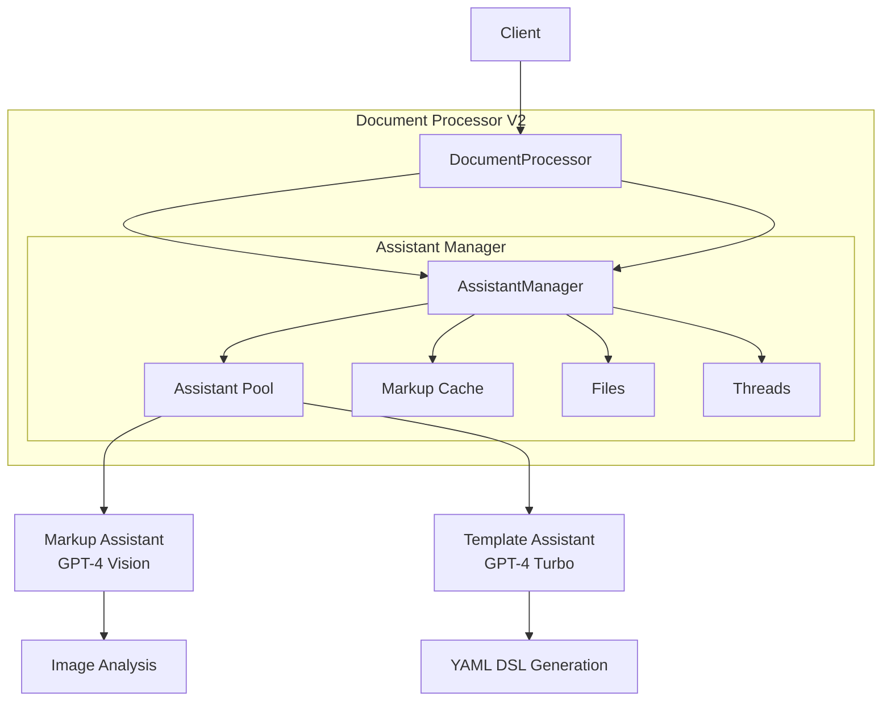
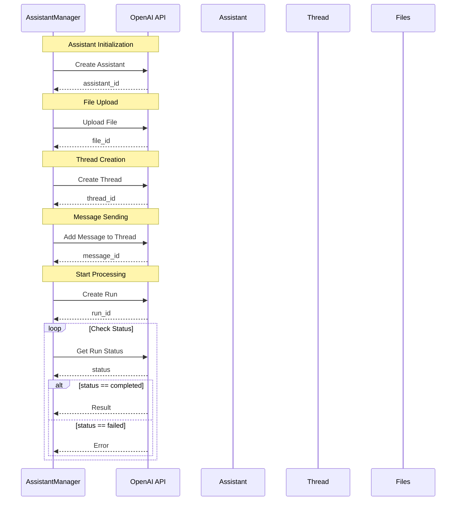
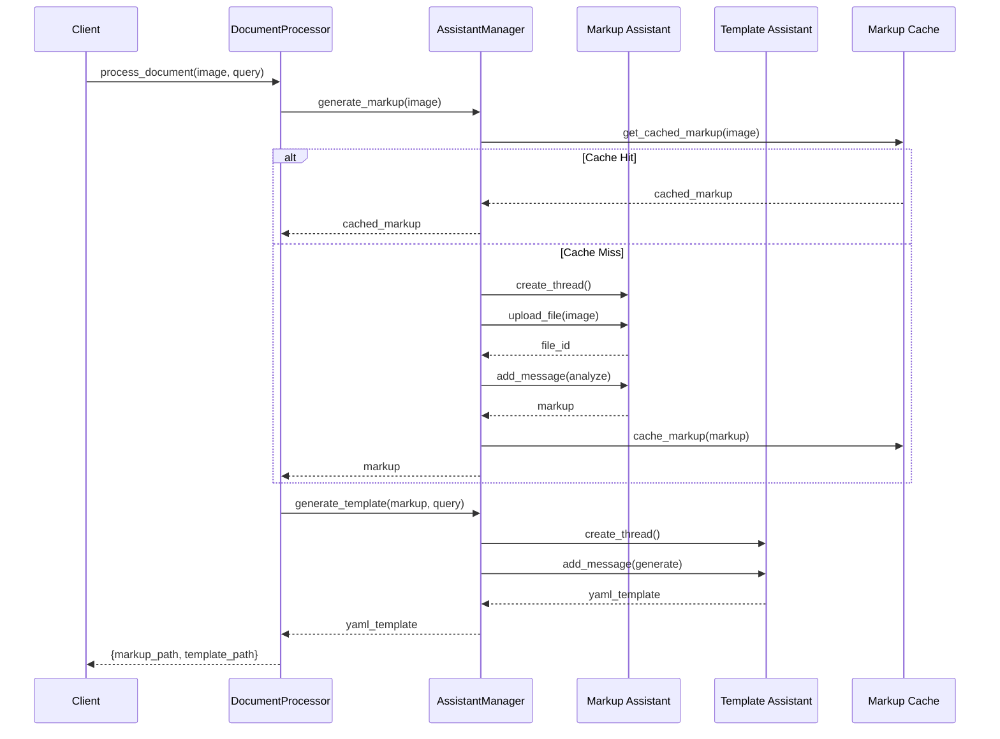
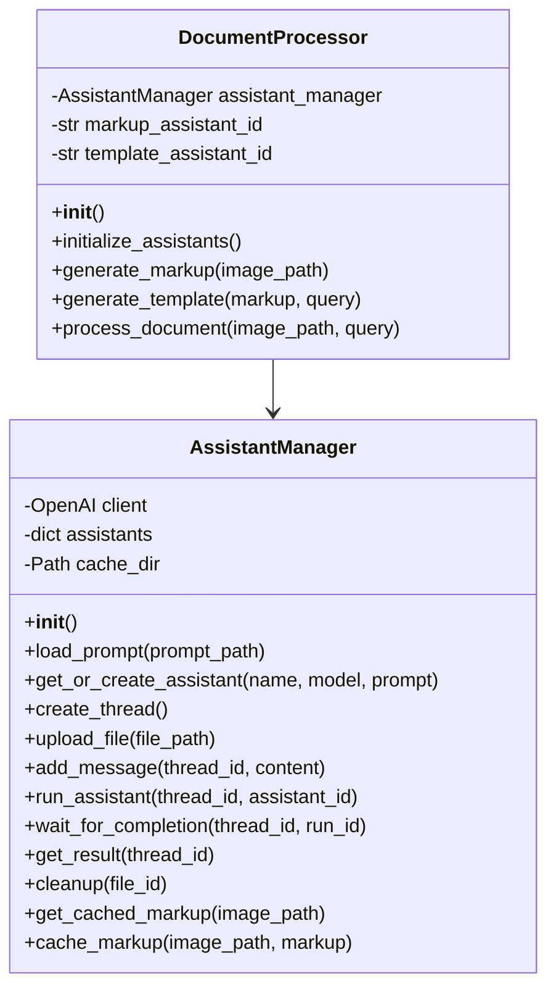
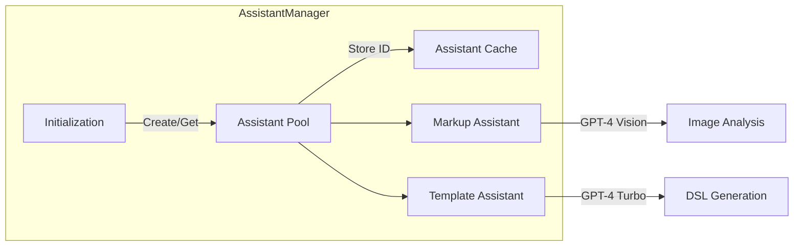
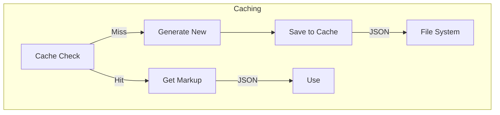
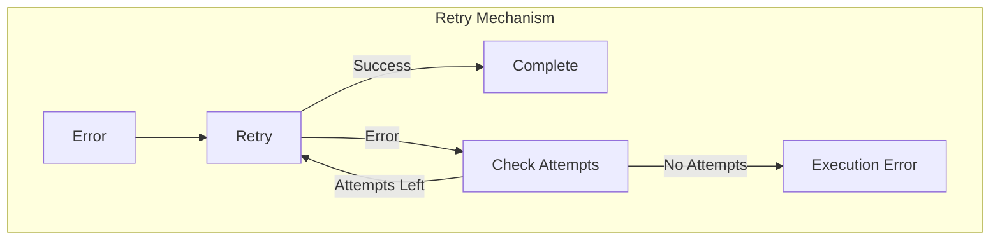

# Архитектура Document Processor V2

## Общая структура

## Взаимодействие с OpenAI Assistant API

## Процесс обработки документа

## Компоненты системы

## Особенности реализации

### 1. Управление ассистентами

### 2. Кэширование разметки

### 3. Обработка ошибок

## Преимущества архитектуры

1. **Разделение ответственности**
   - DocumentProcessor: высокоуровневая логика
   - AssistantManager: управление ресурсами OpenAI
   - Специализированные ассистенты: конкретные задачи

2. **Оптимизация ресурсов**
   - Переиспользование ассистентов
   - Кэширование разметки
   - Эффективное управление файлами

3. **Надежность**
   - Механизм повторных попыток
   - Детальное логирование
   - Корректная очистка ресурсов

4. **Расширяемость**
   - Легкое добавление новых ассистентов
   - Гибкая настройка промптов
   - Модульная структура

## Особенности работы с Assistant API

1. **Переиспользование ассистентов**
   - Ассистенты создаются один раз при инициализации
   - ID ассистентов сохраняются в памяти
   - Повторное использование существующих ассистентов

2. **Управление тредами**
   - Каждый запрос создает новый тред
   - Треды изолируют контекст обработки
   - Автоматическая очистка после использования

3. **Работа с файлами**
   - Временная загрузка для анализа
   - Автоматическая очистка после использования
   - Поддержка различных форматов

4. **Промпты и инструкции**
   - Разделение промптов по задачам
   - Четкие инструкции для каждого ассистента
   - Возможность настройки под конкретные типы документов

5. **Обработка результатов**
   - Парсинг JSON разметки
   - Валидация YAML шаблонов
   - Сохранение в файловой системе
