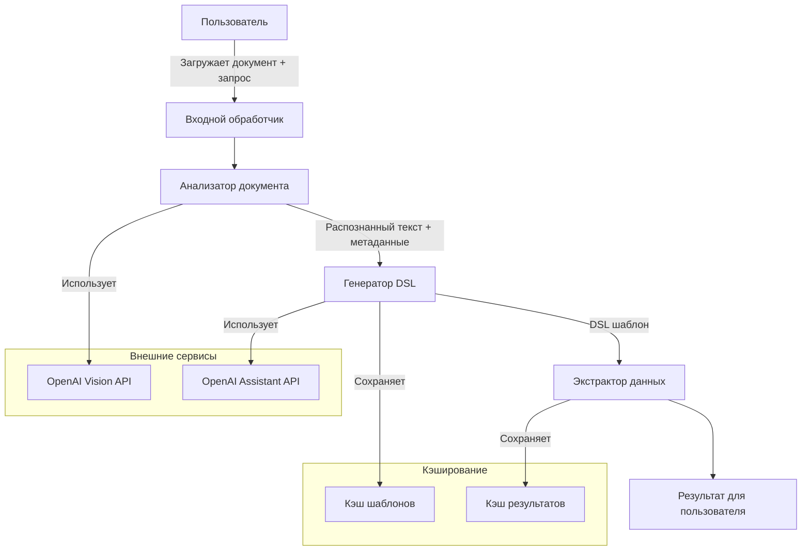

# Архитектура агента для анализа документов и генерации DSL-шаблонов

## Обзор

Данный агент предназначен для анализа документов (в частности, счетов-фактур), распознавания их содержимого и генерации DSL-шаблонов в особом формате для извлечения конкретных данных. Архитектура решения основана на использовании API OpenAI, включая мультимодальные модели для анализа изображений и генерации шаблонов.

## Архитектура решения

Ниже представлена диаграмма архитектуры агента:



## Входные и выходные данные

**Входные данные:**
- Изображение документа (например, JPG файл счёта-фактуры)
- Запрос пользователя (например, "хочу узнать ИНН покупателя")

**Выходные данные:**
- YAML-файл шаблона DSL, который описывает, как найти и извлечь запрошенную информацию

## Компоненты решения и скрипты

### 1. document_uploader.sh

**Назначение**: Загрузка документа в OpenAI Files API

**Основные функции**:
- Валидация входного файла
- Загрузка файла через API OpenAI
- Возврат идентификатора загруженного файла

**Пример использования**:
```bash
./document_uploader.sh path/to/document.jpg
```

### 2. document_analyzer.sh

**Назначение**: Анализ документа с помощью GPT-4 Vision

**Основные функции**:
- Получение изображения документа
- Отправка изображения в OpenAI Vision API
- Распознавание текста, определение типа документа и его структуры
- Формирование JSON с информацией о структуре документа

**Пример использования**:
```bash
./document_analyzer.sh file_id
```

### 3. dsl_generator.sh

**Назначение**: Генерация DSL шаблона на основе распознанного документа

**Основные функции**:
- Получение структуры документа и запроса пользователя
- Определение якорей (anchors) для поиска целевых данных
- Определение области извлечения (extraction_area)
- Задание параметров для постобработки данных
- Формирование YAML-файла DSL шаблона

**Пример использования**:
```bash
./dsl_generator.sh document_json "запрос пользователя"
```

### 4. data_extractor.sh

**Назначение**: Извлечение данных по DSL шаблону

**Основные функции**:
- Применение DSL шаблона к документу
- Извлечение запрашиваемых данных
- Форматирование и возврат результата

**Пример использования**:
```bash
./data_extractor.sh file_id dsl_template.yml
```

### 5. agent_controller.sh

**Назначение**: Координация всех процессов

**Основные функции**:
- Прием документа и запроса пользователя
- Последовательный вызов компонентов обработки
- Обработка ошибок и исключений
- Возврат конечного результата пользователю

**Пример использования**:
```bash
./agent_controller.sh path/to/document.jpg "хочу узнать ИНН покупателя"
```

## Процесс работы

1. **Этап загрузки и первичного анализа**
   - Пользователь загружает документ и формулирует запрос
   - Документ загружается через Files API
   - Производится первичный анализ для определения типа документа

2. **Этап генерации DSL шаблона**
   - На основе типа документа и запроса пользователя, генерируется DSL шаблон
   - Определяются якоря для поиска целевых данных
   - Задаются параметры для постобработки

3. **Этап извлечения данных**
   - Применяется сгенерированный DSL шаблон к документу
   - Извлекаются запрашиваемые данные
   - Результат форматируется для пользователя

4. **Этап возврата результата**
   - Пользователь получает извлеченные данные
   - DSL шаблон сохраняется для повторного использования

## Ключевые промпты

### Промпт для анализа документа:

```
Проанализируй изображение документа и определи:
1. Тип документа (счет-фактура, накладная и т.д.)
2. Основные разделы документа
3. Расположение ключевых элементов (ИНН, КПП, даты, суммы и т.д.)

Представь результат в формате JSON со следующей структурой:
{
  "document_type": "тип документа",
  "sections": [
    {
      "name": "название раздела",
      "bbox": {"x1": X, "y1": Y, "x2": X, "y2": Y}
    }
  ],
  "key_elements": [
    {
      "name": "название элемента",
      "value": "значение элемента",
      "bbox": {"x1": X, "y1": Y, "x2": X, "y2": Y}
    }
  ]
}
```

### Промпт для генерации DSL шаблона:

```
На основе анализа документа и запроса пользователя "{user_query}" создай DSL шаблон в формате YAML для извлечения запрашиваемой информации.

Шаблон должен включать:
1. Якоря (anchors) - текстовые элементы, рядом с которыми находится искомая информация
2. Области извлечения (extraction_area) - относительные координаты для поиска информации
3. Параметры постобработки - регулярные выражения для извлечения точных значений
```

### Промпт для извлечения данных:

```
Примени этот DSL шаблон к документу и извлеки запрашиваемую информацию.
Шаблон: {dsl_template}

Верни извлеченное значение и укажи, как оно было найдено (какие якоря использовались, где была найдена информация).
```

## Обработка ошибок

Агент включает механизмы обработки следующих типов ошибок:
1. Ошибки загрузки документа
2. Ошибки распознавания текста
3. Ошибки генерации DSL шаблона
4. Ошибки извлечения данных

Для каждого типа ошибок предусмотрены соответствующие сообщения и действия по их устранению.

## Кэширование и оптимизация

Для оптимизации работы агента используются следующие подходы:
1. Кэширование результатов анализа документов
2. Сохранение и повторное использование DSL шаблонов
3. Параллельная обработка запросов, где это возможно

## Требования к окружению

- Bash
- curl
- jq (для обработки JSON)
- yq (для обработки YAML)
- OpenAI API ключ
