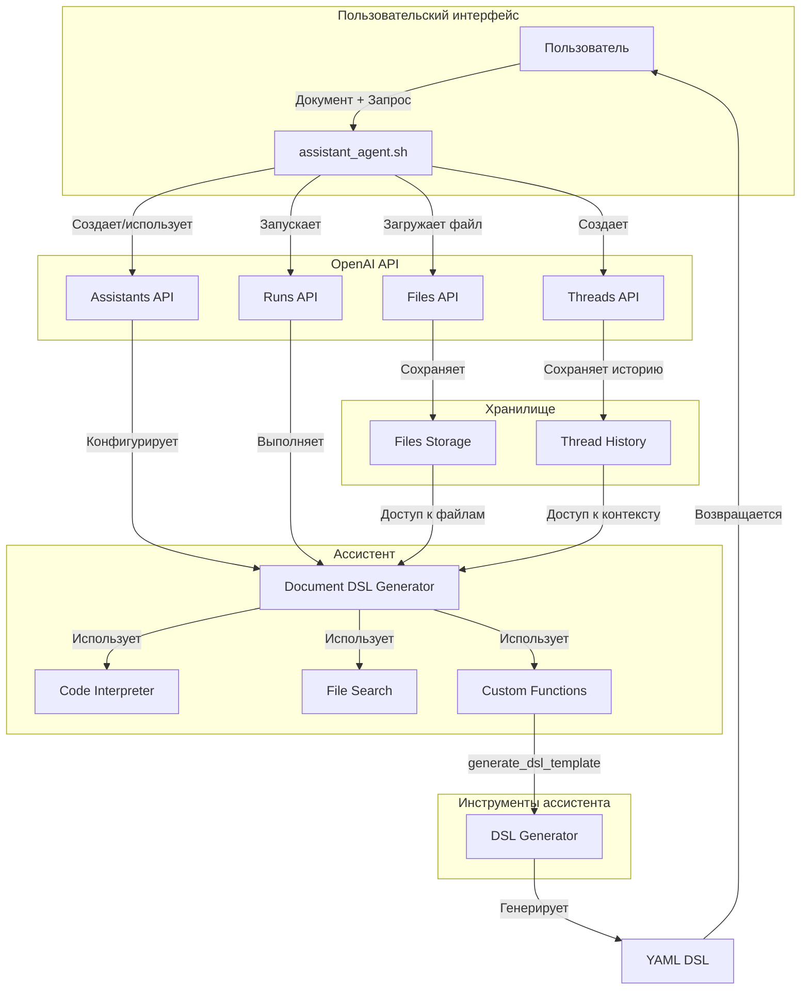

# Архитектура решения на базе OpenAI Assistants API

## Обзор

Данное решение использует OpenAI Assistants API для создания интеллектуального агента, способного анализировать документы и генерировать DSL-шаблоны для извлечения данных. В отличие от прямого использования Chat Completions API, этот подход предоставляет более богатые возможности для работы с документами и контекстом.

## Архитектура



## Компоненты системы

### 1. Пользовательский интерфейс (assistant_agent.sh)
- Принимает документ и запрос пользователя
- Координирует взаимодействие с API OpenAI
- Управляет жизненным циклом ассистента и файлов

### 2. OpenAI API
- **Files API**: Управление загрузкой и хранением документов
- **Assistants API**: Создание и настройка ассистентов
- **Threads API**: Управление контекстом диалога
- **Runs API**: Выполнение задач ассистентом

### 3. Ассистент (Document DSL Generator)
- Анализирует документы с помощью GPT-4 Vision
- Использует инструменты для обработки данных
- Генерирует DSL-шаблоны через custom functions

### 4. Инструменты
- **Code Interpreter**: Выполнение Python-кода для обработки данных
- **File Search**: Поиск информации в документах
- **Custom Functions**: Специализированные функции для генерации DSL

## Процесс работы

1. **Инициализация**
   ```mermaid
   sequenceDiagram
       participant U as Пользователь
       participant A as assistant_agent.sh
       participant F as Files API
       participant AS as Assistants API
       
       U->>A: Документ + Запрос
       A->>F: Загрузка документа
       F-->>A: File ID
       A->>AS: Создание ассистента
       AS-->>A: Assistant ID
   ```

2. **Обработка запроса**
   ```mermaid
   sequenceDiagram
       participant A as assistant_agent.sh
       participant T as Threads API
       participant R as Runs API
       participant AS as Ассистент
       
       A->>T: Создание треда
       T-->>A: Thread ID
       A->>R: Запуск обработки
       R->>AS: Выполнение анализа
       AS->>AS: Использование инструментов
       AS-->>R: Генерация DSL
       R-->>A: Результат
   ```

## Преимущества архитектуры

1. **Управление состоянием**
   - Персистентность контекста через треды
   - Автоматическое управление файлами
   - Отслеживание статуса выполнения

2. **Расширяемость**
   - Добавление новых инструментов
   - Настройка поведения через инструкции
   - Возможность обучения на примерах

3. **Надежность**
   - Встроенная обработка ошибок
   - Возможность повторных попыток
   - Валидация результатов

4. **Производительность**
   - Асинхронное выполнение
   - Параллельная обработка инструментов
   - Кэширование результатов

## Конфигурация ассистента

```yaml
name: Document DSL Generator
model: gpt-4-vision-preview
instructions: |
  Ты - эксперт по анализу документов и созданию DSL шаблонов.
  Анализируй документы и создавай YAML шаблоны для извлечения данных.
tools:
  - type: code_interpreter
  - type: file_search
  - type: function
    function:
      name: generate_dsl_template
      description: Генерирует DSL шаблон
      parameters:
        type: object
        properties:
          target_field:
            type: string
          anchors:
            type: array
          extraction_area:
            type: object
```

## Обработка ошибок

1. **Ошибки API**
   - Повторные попытки при сетевых ошибках
   - Обработка ограничений API
   - Логирование проблем

2. **Ошибки анализа**
   - Валидация результатов
   - Альтернативные стратегии поиска
   - Обратная связь пользователю

3. **Ошибки генерации DSL**
   - Проверка структуры YAML
   - Валидация якорей
   - Проверка областей извлечения
